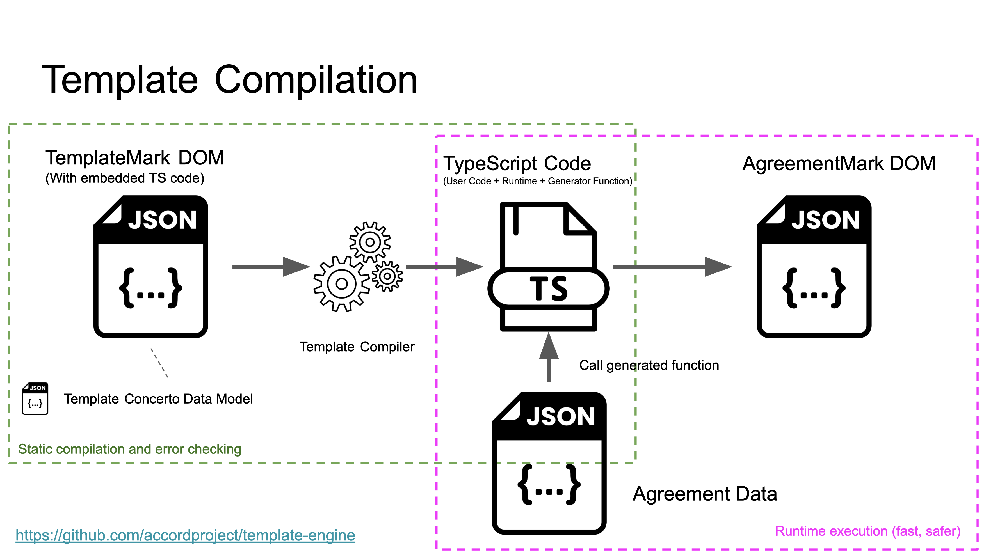

# Template Compiler

This is the [Accord Project](https://accordproject.org) template compiler. Rich-text templates are defined in TemplateMark (either as markdown files, or JSON documents) and are then merged with JSON data to produce output documents. Templates may contain [TypeScript](https://www.typescriptlang.org) expressions.

Templates are statically compiled to TypeScript programs, enforcing type-safety, ensuring that no unsafe code evaluation ("eval") is required at runtime, and easing integration into applications.



> Note that templates may also be executed using an interpreter for more dynamic scenarios.

Accord Project template compilation is inspired by prior work on template compilation, not least [JSP](https://gist.github.com/sunfmin/5124605), but also work in the [Scala](https://www.playframework.com/documentation/2.1.0/ScalaTemplates), [Dart](http://blog.sethladd.com/2012/03/first-look-at-darts-html-template.html) and [Go](http://sunfmin.com/2013/03/22/a-compiled-template-for-golang.html) communities.

## Install

Note that this module is primarily intended for tool authors, or developers embedding template engines within applications. For command-line usage please refer to the `@accordproject/template-cli` package which implements a full pipeline to convert markdown templates plus JSON data to supported output formats, such as HTML, DOCX or PDF.

```
npm install @accordproject/template-compiler --save
```

## License <a name="license"></a>
Accord Project source code files are made available under the Apache License, Version 2.0 (Apache-2.0), located in the LICENSE file. Accord Project documentation files are made available under the Creative Commons Attribution 4.0 International License (CC-BY-4.0), available at http://creativecommons.org/licenses/by/4.0/.

